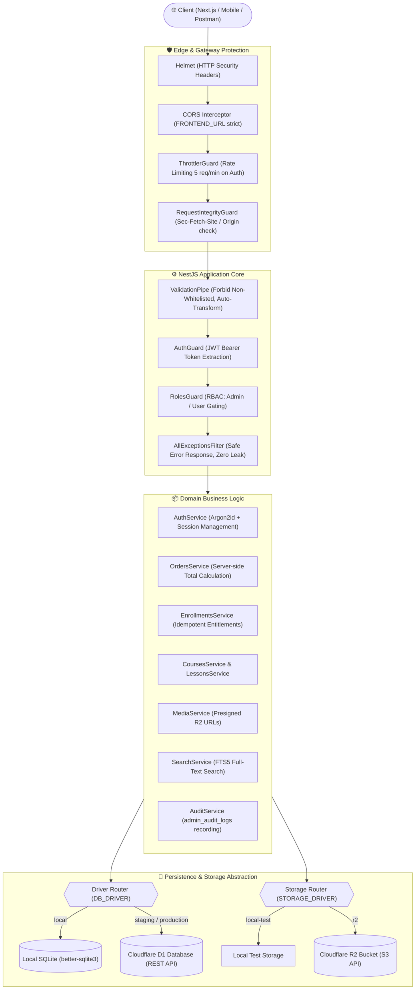
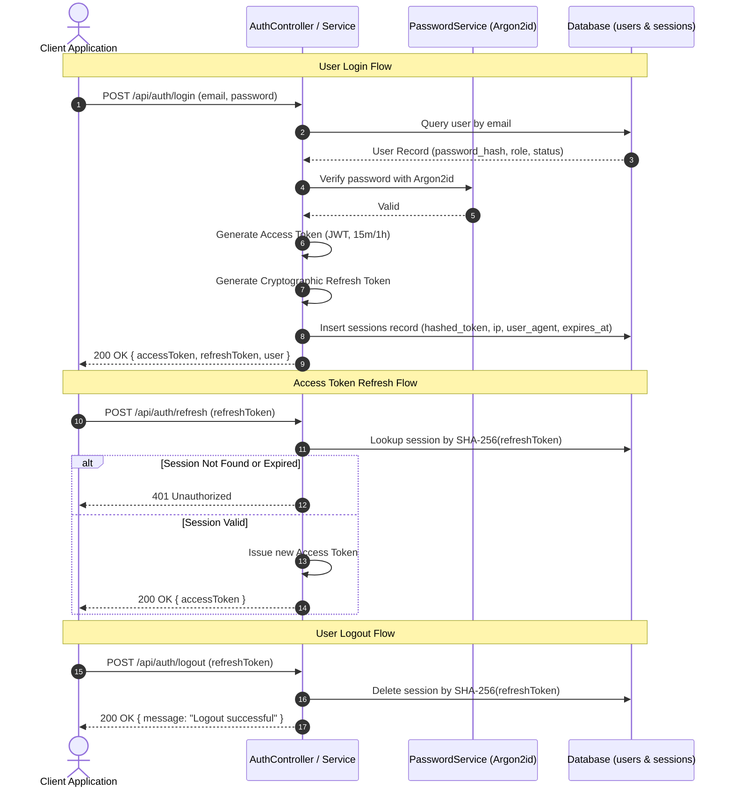
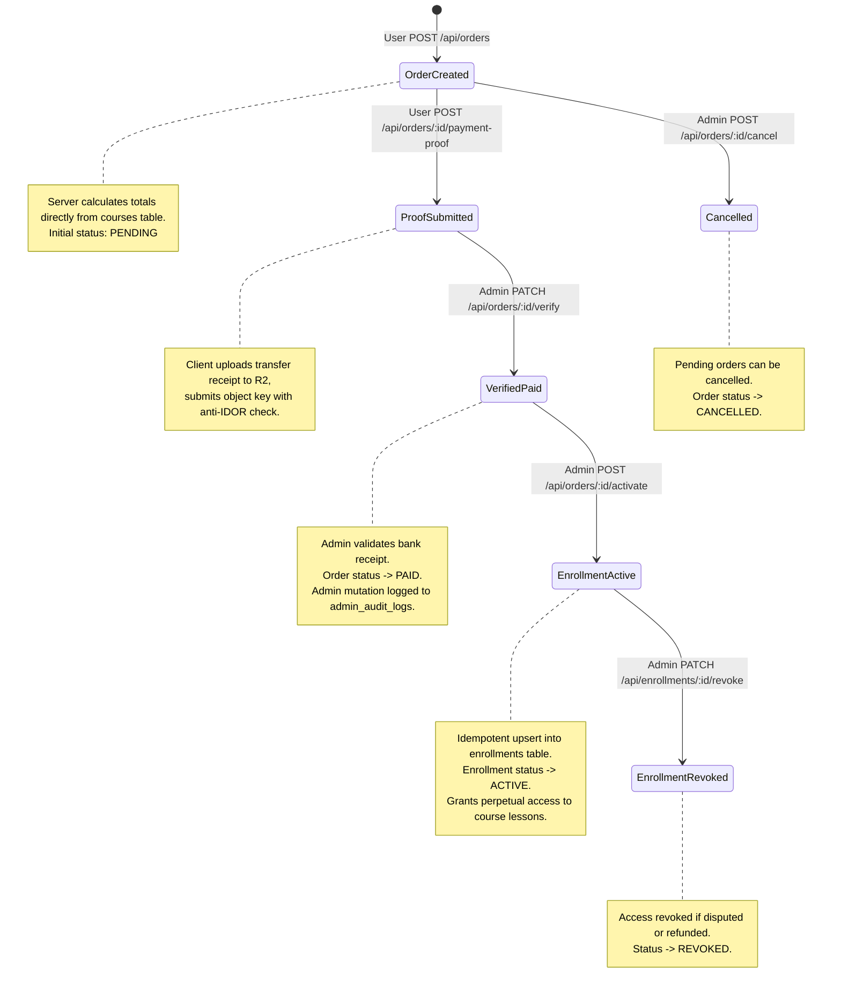
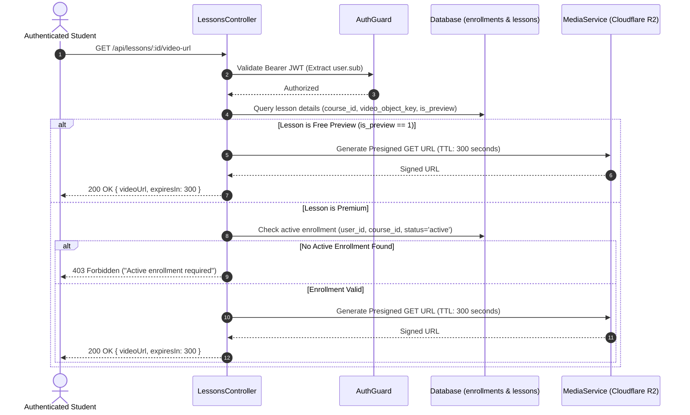
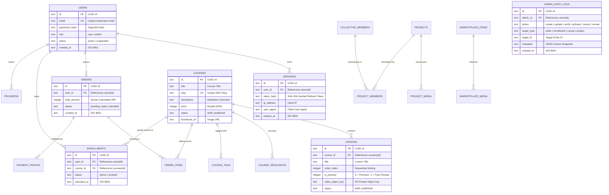

# 🚀 Xolvon Backend API — AI Business Collective Engine

<p align="center">
  
</p>

<p align="center">
  <strong>Enterprise-Grade, Zero-Trust Backend Architecture for Xolvon.com</strong><br />
  Built with <em>NestJS 12</em>, <em>TypeScript (Strict ESM)</em>, <em>Cloudflare D1 / SQLite</em>, and <em>Cloudflare R2</em>.
</p>

<p align="center">
  
  
  
  
  
  
  
</p>

---

## 📑 Table of Contents

1. [Executive Overview & Philosophy](#-executive-overview--philosophy)
2. [System Architecture & Request Lifecycle](#-system-architecture--request-lifecycle)
3. [Domain Workflows & Flowcharts](#-domain-workflows--flowcharts)
   - [Authentication & Session Rotation](#1-authentication--session-rotation)
   - [E-Commerce & Entitlement Lifecycle](#2-e-commerce--entitlement-lifecycle)
   - [Secure Media & Video Streaming Flow](#3-secure-media--video-streaming-flow)
4. [Entity-Relationship Diagram (ERD)](#-entity-relationship-diagram-erd)
5. [Core Modules Breakdown](#-core-modules-breakdown)
6. [API Contract & Endpoint Matrix](#-api-contract--endpoint-matrix)
7. [Environment Variables & Security Configuration](#-environment-variables--security-configuration)
8. [Installation & Local Setup](#-installation--local-setup)
9. [Testing & Quality Assurance](#-testing--quality-assurance)
10. [Postman Collection Integration](#-postman-collection-integration)
11. [Production Operations & Deployment](#-production-operations--deployment)

---

## 🏛 Executive Overview & Philosophy

The **Xolvon Backend Engine** powers the digital ecosystem of **PT Xolvon Kehidupan Cerdas Abadi** (`xolvon.com`), facilitating online courses, student enrollment entitlements, project portfolios, collective talent networks, and SaaS marketplace discovery.

### Core Architectural Axioms

1. **"Server Owns Trust"**: Client input is untrusted by default. Entitlements, payments, pricing, role elevation, and video access control are strictly determined and signed by the server.
2. **Dual-Driver Database Architecture**:
   - **Local Development**: Ultra-fast, zero-cloud dependency via `better-sqlite3` on `local.db`.
   - **Staging / Production**: Serverless edge persistence via **Cloudflare D1 REST API** with SQL transactional integrity.
3. **Dual-Driver Storage Architecture**:
   - **Local Development**: Self-contained local disk simulation via `LocalTestStorageService`.
   - **Staging / Production**: Cloudflare R2 object storage utilizing AWS S3 SDK v3 presigned URLs (PUT upload: 3600s, GET streaming: 300s).
4. **Defense in Depth**:
   - Password hashing with memory-hard **Argon2id**.
   - Session tracking with hashed refresh tokens and IP/User-Agent fingerprinting.
   - **Request Integrity Guard** enforcing cross-origin restrictions (`Sec-Fetch-Site` & `Origin`) against CSRF on state-mutating requests.
   - Strict DTO schema validation (`whitelist: true`, `forbidNonWhitelisted: true`, `transform: true`).
   - Immutable audit logging (`admin_audit_logs`) for all administrative state mutations.

---

## 📐 System Architecture & Request Lifecycle

The diagram below illustrates how an incoming client request traverses through reverse proxies, security filters, guards, domain pipes, and database/storage drivers:



---

## 🔄 Domain Workflows & Flowcharts

### 1. Authentication & Session Rotation

The authentication flow utilizes short-lived JWT access tokens alongside database-backed, SHA-256 hashed refresh tokens with continuous session rotation.



---

### 2. E-Commerce & Entitlement Lifecycle

To uphold absolute integrity in commercial transactions, pricing is computed exclusively on the server, and enrollment activation requires an explicit manual payment proof workflow with admin verification.



---

### 3. Secure Media & Video Streaming Flow

Video content and sensitive educational materials are **never served directly** via public URLs. Instead, temporary presigned URLs are minted only after verifying valid enrollment status.



---

## 🗄 Entity-Relationship Diagram (ERD)

The relational schema is enforced via strict SQLite/D1 constraints, primary key UUIDs, ISO 8601 timestamps, and foreign key cascades:



---

## 🧩 Core Modules Breakdown

| Module | Directory | Key Responsibilities |
|---|---|---|
| **AuthModule** | `src/auth/` | Registration, Argon2id hashing, dual-token JWT issuing, IP/UserAgent session auditing, refresh rotation. |
| **CoursesModule** | `src/courses/` | Course catalog, published-only public queries, draft-gated admin management, slug uniqueness guards. |
| **LessonsModule** | `src/lessons/` | Lesson ordering (`order_index`), summary public stripping, presigned video streaming URL generation. |
| **OrdersModule** | `src/orders/` | Order creation with server-computed totals, receipt proof submission with anti-IDOR, admin verification & cancellation. |
| **EnrollmentsModule** | `src/enrollments/` | Idempotent student access activation, course progress authorization, admin revocation. |
| **ProjectsModule** | `src/projects/` | Studio portfolio showcase, structured narrative formatting (Problem → Solution → Tech → Result), media attachments. |
| **CollectiveModule** | `src/collective/` | Network roster of verified developers, designers, and AI architects with role mappings. |
| **MarketplaceModule** | `src/marketplace/` | Curated showcase of AI SaaS products with validated outbound destinations. |
| **MediaModule** | `src/media/` | S3-compatible R2 abstraction, presigned PUT upload minting with MIME/size validation, presigned GET streaming. |
| **SearchModule** | `src/search/` | High-performance multi-domain full-text search (Courses, Projects, SaaS) backed by SQLite FTS5. |
| **AdminModule** | `src/admin/` | High-level metrics overview (users, pending orders, active enrollments), customer management, audit trails. |
| **DatabaseModule** | `src/database/` | Abstraction unifying `better-sqlite3` and Cloudflare D1 REST API with automated migrations. |

---

## 📡 API Contract & Endpoint Matrix

All endpoints are served under the global prefix `/api`.

### 1. Authentication & Identity (`/api/auth`)
- `POST /api/auth/register` — Public registration (Always defaults to role `user`).
- `POST /api/auth/login` — Public login returning `{ accessToken, refreshToken, user }` (Rate limited: 5 req/min).
- `POST /api/auth/refresh` — Issue a new `accessToken` from a valid `refreshToken`.
- `POST /api/auth/logout` — Revoke and delete current refresh session.
- `GET /api/auth/me` — Inspect current user token payload (Requires Bearer JWT).
- `GET /api/auth/admin` — Guard validation confirming `admin` role elevation.

### 2. Courses & Curriculum (`/api/courses`, `/api/lessons`)
- `GET /api/courses` — Paginated published course catalog with keyword search (`?q=`, `?page=`, `?limit=`).
- `GET /api/courses/:slug` — Published course details with public lesson summary (Strips private video keys).
- `POST /api/courses` — **[Admin]** Create course draft.
- `PATCH /api/courses/:id` — **[Admin]** Update course metadata.
- `POST /api/courses/:id/publish` — **[Admin]** Gate-validated state transition to `published`.
- `POST /api/courses/:id/unpublish` — **[Admin]** Revert course to `draft`.
- `GET /api/courses/:courseId/lessons` — Retrieve lesson list for a course.
- `POST /api/courses/:courseId/lessons` — **[Admin]** Append lesson to course.
- `PATCH /api/lessons/:id/reorder` — **[Admin]** Update lesson sequence index.
- `GET /api/lessons/:id/video-url` — **[Student/Admin]** Mint temporary 300s presigned video streaming URL (Gated by enrollment).

### 3. Orders & Student Learning (`/api/orders`, `/api/enrollments`, `/api/progress`)
- `POST /api/orders` — Checkout course; returns pending order with server-calculated price.
- `POST /api/orders/:id/payment-proof` — Upload proof of bank transfer receipt.
- `PATCH /api/orders/:id/verify` — **[Admin]** Verify payment receipt (`pending` → `paid`).
- `POST /api/orders/:id/activate` — **[Admin]** Idempotently activate course enrollment for student.
- `POST /api/orders/:id/cancel` — **[Admin]** Cancel an unfulfilled pending order.
- `GET /api/enrollments/me` — List all active course enrollments belonging to caller.
- `PATCH /api/enrollments/:id/revoke` — **[Admin]** Revoke course access.
- `POST /api/progress` — Update lesson completion state (`is_completed: 1`).
- `GET /api/progress` — Retrieve user's overall learning progress.

### 4. Projects & Collective (`/api/projects`, `/api/collective`)
- `GET /api/projects` — Published portfolio listings with narrative previews.
- `GET /api/projects/:slug` — Deep project view including team members and public screenshots.
- `POST /api/projects` — **[Admin]** Create new portfolio entry.
- `POST /api/projects/:id/media` — **[Admin]** Attach screenshot/diagram to project.
- `POST /api/projects/:id/members` — **[Admin]** Link a collective member with their role.
- `GET /api/collective` — List active collective members and specialist skill tags.
- `GET /api/collective/:slug` — Member profile and associated portfolio projects.

### 5. Marketplace & Search (`/api/marketplace`, `/api/search`)
- `GET /api/marketplace` — Published SaaS and AI micro-products catalog.
- `GET /api/marketplace/:slug` — Product details with capability tags and outbound link.
- `GET /api/search` — Unified FTS5 search across courses, projects, and marketplace items (`?q=term`).

### 6. Administration & Storage Operations (`/api/admin`)
- `GET /api/admin/overview` — High-level dashboard counters (Total Users, Pending Orders, Active Enrollments).
- `GET /api/admin/users` — Paginated administrative customer registry.
- `GET /api/admin/orders` — Order audit log with payment proof inspection links.
- `POST /api/admin/media/upload-url` — **[Admin]** Generate presigned R2 PUT URL with strict MIME and size rules.
- `POST /api/admin/media/confirm` — **[Admin]** Confirm successful upload and register object metadata.

---

## 🔐 Environment Variables & Security Configuration

The application implements a **fail-fast configuration validator** (`src/config/env.validation.ts`). If any required parameter is missing or malformed, bootstrap terminates immediately without leaking secrets.

Create a `.env` file in the project root based on `.env.example`:

```env
# Application Environment (local | staging | production)
APP_ENV=local
PORT=3000
FRONTEND_URL=http://localhost:3001

# Database Configuration (sqlite | d1)
DB_DRIVER=sqlite
# Cloudflare D1 Credentials (Required if DB_DRIVER=d1)
# CLOUDFLARE_ACCOUNT_ID=
# CLOUDFLARE_D1_DATABASE_ID=
# CLOUDFLARE_API_TOKEN=

# Cryptographic Keys (Minimum 32 characters)
JWT_SECRET=super_secret_cryptographic_key_minimum_32_characters_long

# Media Storage Configuration (local-test | r2)
STORAGE_DRIVER=local-test
# Cloudflare R2 Credentials (Required if STORAGE_DRIVER=r2)
# R2_ENDPOINT=https://<account_id>.r2.cloudflarestorage.com
# R2_BUCKET=xolvon-storage
# R2_ACCESS_KEY_ID=
# R2_SECRET_ACCESS_KEY=
```

---

## 💻 Installation & Local Setup

### 1. Prerequisites
- **Node.js**: v22.0.0 or higher
- **npm**: v10.0.0 or higher

### 2. Install Dependencies
```bash
npm install
```

### 3. Initialize Database & Run Migrations
In local mode (`DB_DRIVER=sqlite`), SQLite database migrations in `src/database/migrations/` execute automatically upon application startup.

To seed the initial Administrator account:
```bash
ADMIN_BOOTSTRAP_EMAIL="admin@xolvon.com" ADMIN_BOOTSTRAP_PASSWORD="SuperSecretPassword123!" npm run seed:admin
```

### 4. Start Development Server
```bash
# Start with hot-reload watcher
npm run start:dev

# Start in production mode
npm run start:prod
```
The API server will listen on `http://localhost:3000/api`.

---

## 🧪 Testing & Quality Assurance

Due to NestJS 12 running native ECMAScript Modules (ESM), the test runner must be executed with experimental VM module support enabled:

```bash
# Run complete unit test suite (38 suites, 335 tests)
npm run test:esm

# Run specific unit test file
npm run test:esm -- src/auth/auth.service.spec.ts

# Run end-to-end (E2E) integration tests
npm run test:e2e

# Generate test coverage report
npm run test:cov

# Run code linter (Oxlint)
npm run lint

# Format code with Prettier
npm run format
```

> **Zero Cloud Credentials in Tests**: All unit and integration tests utilize in-memory mock adapters (`LocalTestStorageService`, mock `DatabaseService`). Tests **never** contact Cloudflare or external networks during execution.

---

## 📬 Postman Collection Integration

A complete, pre-configured Postman collection is included directly in the repository: [`Xolvon-API.postman_collection.json`](Xolvon-API.postman_collection.json).

### Features:
1. **Automated Token Chaining**: Logging in via `/api/auth/login` automatically stores `accessToken` and `refreshToken` into collection variables.
2. **Organized Folders**:
   - `00. Health & Public`
   - `01. Auth`
   - `02. Courses & Lessons`
   - `03. Projects`
   - `04. Collective`
   - `05. Marketplace`
   - `06. Orders & Learning`
   - `07. Admin & Media`
3. **Environment Variables Configured**:
   - `baseUrl`: `http://localhost:3000/api`
   - `email`: `user@example.com`
   - `adminEmail`: `admin@example.com`

---

## 🚢 Production Operations & Deployment

### Cloudflare D1 Migration Execution
When operating against live Cloudflare D1 databases, execute migrations using Wrangler:
```bash
npx wrangler d1 migrations apply xolvon-course-db --remote
```

### Production Checklist
- [x] Set `APP_ENV=production` and `DB_DRIVER=d1`.
- [x] Ensure `FRONTEND_URL` strictly matches your production domain (e.g., `https://xolvon.com`).
- [x] Secure `JWT_SECRET` in deployment secret manager (Cloudflare Secrets / AWS Secrets Manager).
- [x] Provision dedicated Cloudflare R2 bucket with restrictive CORS policies.
- [x] Verify rate limiting thresholds on sensitive authentication routes.

---

## 📄 License & Organization

Copyright © 2026 **PT Xolvon Kehidupan Cerdas Abadi**. All rights reserved.  
Maintained by the **Xolvon Collective Engineering Team**.
